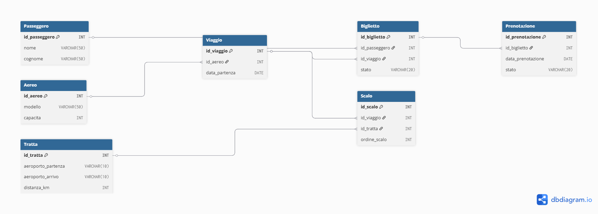

# ITA Airways – Project Work Database

Questo repository contiene il dump SQL del database progettato per il **Project Work** del Corso di Laurea in *Informatica per le Aziende Digitali (L-31)*, con focus sulla **modellazione dei dati per il monitoraggio operativo della flotta ITA Airways**.

## 🎯 Obiettivo del progetto

Progettare un **sistema informativo per il monitoraggio in tempo reale degli aeromobili**, con particolare attenzione a:
- Tracciamento della posizione (coordinate GPS, altitudine, timestamp)
- Registrazione e gestione degli eventi operativi (ritardi, manutenzioni, emergenze)
- Monitoraggio dei consumi di carburante per singolo volo
- Supporto alla manutenzione predittiva e alla sostenibilità ambientale
- Produzione di viste e query utili alla **Direzione Operativa** per l’analisi decisionale

## 📂 Contenuto del repository

- `ITA_Airways_DB_script.sql`: file SQL con struttura relazionale, dati realistici, viste e query.
- `diagramma_ER_ITA_Airways.png`: immagine del diagramma ER.
- `README.md`: guida all’importazione, uso e test del database.

## 🧰 Requisiti

È consigliato l’uso di un ambiente compatibile con **PostgreSQL**:

- PostgreSQL 15 o superiore (raccomandato)
- dbfiddle.uk (per test online)
- DBeaver, pgAdmin, Azure Data Studio o simili

## 🛠️ Istruzioni per l'uso

1. Scarica il file **`ITA_Airways_DB_script.sql`** da questo repository.
2. Aprilo con un ambiente SQL compatibile (es. dbfiddle.uk o PostgreSQL locale).
3. Esegui lo script per:
   - Creare le tabelle e i vincoli relazionali
   - Popolare il database con **dati aziendali simulati**
   - Creare viste e lanciare query operative

## ✈️ Funzionalità del database

Il sistema progettato consente di:
- Tracciare in tempo reale la posizione degli aerei in volo
- Registrare eventi tecnici e operativi con storico dettagliato
- Calcolare i consumi effettivi e l’efficienza energetica per tratta
- Generare viste aggregate (es. posizione attuale di tutta la flotta)
- Estrarre KPI utili alla pianificazione e al controllo

## ✅ Query SQL incluse

Tra le principali query operative presenti nello script:
- ✅ Ultima posizione GPS per ciascun aereo
- ✅ Storico eventi tecnici di un aeromobile
- ✅ Consumo medio per modello di aereo
- ✅ Efficienza in litri/km per tratta
- ✅ Tratte più dispendiose in termini di carburante

Inoltre, è presente una **vista SQL (`Vista_Posizione_Attuale`)** per un aggiornamento immediato della flotta.

## 🔗 Utilizzo online

Puoi testare lo script direttamente su:
- [https://dbfiddle.uk](https://dbfiddle.uk) → Seleziona "PostgreSQL 15" o superiore

*(Nota: alcune funzioni come `CURRENT_TIMESTAMP` richiedono un motore SQL con gestione reale del tempo)*

## 📊 Diagramma ER

Il seguente diagramma entità-relazioni (ER) mostra le tabelle e le relazioni tra:
- Aerei
- Tratte
- Viaggi
- Eventi operativi
- Posizioni GPS
- Consumi carburante

  

### 🛠 Strumento utilizzato

Il diagramma è stato creato con [**dbdiagram.io**](https://dbdiagram.io), uno strumento gratuito per la modellazione concettuale.

## 📘 Autore

- **Nome**: *Paolo Stranges*
- **Matricola**: *0312201143*
- **Università**: *Università Telematica Pegaso*
- **Corso di laurea**: *Informatica per le Aziende Digitali (L-31)*
