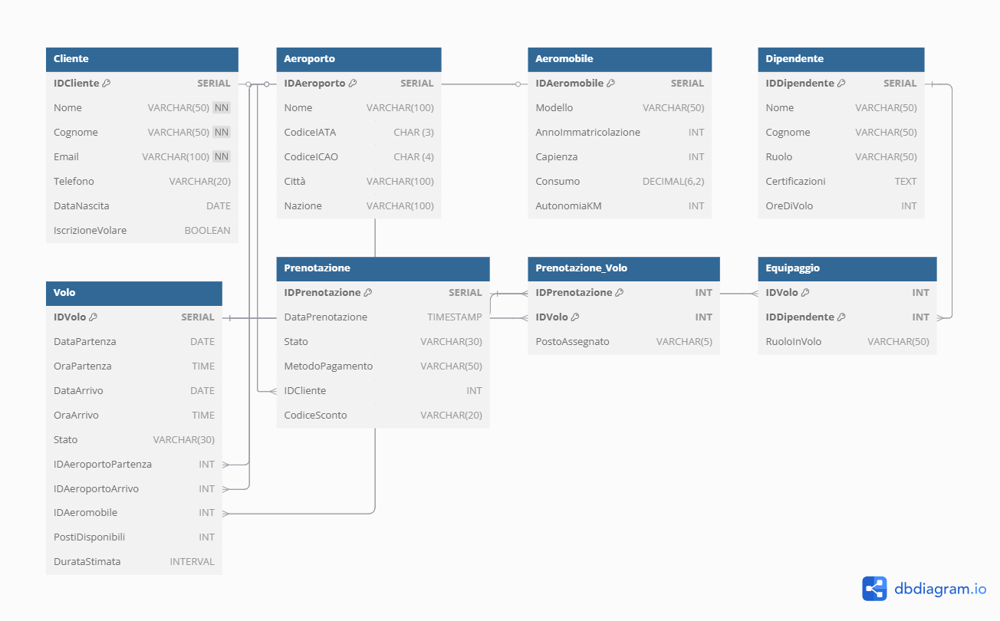

# ITA Airways – Project Work Database

Questo repository contiene il dump SQL del database progettato per il **Project Work** del Corso di Laurea in *Informatica per le Aziende Digitali (L-31)*, con focus sulla **modellazione dei dati per ITA Airways**.

## 🎯 Obiettivo del progetto

Progettare uno **schema di persistenza dei dati** a supporto del processo di **vendita dei biglietti aerei**, in un contesto realistico e scalabile. Il sistema gestisce:
- Tratte, voli e scali
- Aeroporti e aeromobili
- Clienti, prenotazioni e biglietti
- Pagamenti, metodi e tariffe
- Esecuzione di **query SQL rappresentative** di operazioni tipiche

## 📂 Contenuto del repository

- `ITA_Airways_DB_script.sql`: file SQL aggiornato con struttura relazionale, dati descrittivi e query di test.
- `diagramma_ER_ITA_Airways.png`: immagine del diagramma ER.
- `ITA_Airways_DB_script.sql`: codice sorgente del diagramma in formato SQL.
- `README.md`: guida completa per importazione, utilizzo e test del database.

## 🧰 Requisiti

Puoi usare qualsiasi ambiente SQL che supporti standard ANSI SQL:

- **PostgreSQL** (raccomandato)
- **SQLite 3** (compatibile con lievi modifiche)
- **DBMS alternativi**: DBeaver, SQLiteStudio, DB Browser, dbfiddle.uk

## 🛠️ Istruzioni per l'uso

1. Scarica il file **`ITA_Airways_DB_script.sql`** da questo repository.
2. Aprilo con uno dei seguenti strumenti:
   - [DB Browser for SQLite](https://sqlitebrowser.org/)
   - [DBeaver.io](https://dbeaver.io/)
   - [SQLiteStudio](https://sqlitestudio.pl/)
   - oppure da terminale con `psql` o `sqlite3`.
3. Esegui l'intero script per:
   - Creare le tabelle e i vincoli
   - Popolare il database con **dati realistici**
   - Testare **5 query SQL fondamentali**
4. (Facoltativo) Modifica gli `INSERT` o aggiungi nuovi `SELECT` per simulare **input utente**.

## 💡 Funzionalità extra

Il database include:
- Campi descrittivi aggiuntivi (`Descrizione`, `TipoPosto`, `Note`, `StatoPagamento`)
- Tipologie cliente e tariffe (es. "Frequent flyer", "Business")
- Dati realistici per test e simulazione di casi aziendali
- Commenti esplicativi nel codice per facilitare la comprensione

## ✅ Query SQL di esempio

Il progetto include query per:
- ✅ Ricerca voli disponibili tra due città in una data specifica
- ✅ Storico prenotazioni di un determinato cliente
- ✅ Verifica della validità temporale di un biglietto
- ✅ Elenco dei passeggeri assegnati a un volo
- ✅ Analisi delle tratte più prenotate in un intervallo

## 🔗 Utilizzo online

Per test immediato, puoi incollare lo script su:
- [https://dbfiddle.uk](https://dbfiddle.uk) → Seleziona "PostgreSQL 16"
- oppure eseguire su un tuo DB PostgreSQL locale

*(NB: il supporto per NOW() può variare su alcuni compilatori SQL online)*

## 📊 Diagramma ER

Il seguente **diagramma entità-relazioni (ER)** visualizza la struttura logica del database progettato, mostrando le entità principali (Clienti, Voli, Prenotazioni, ecc.) e le relazioni tra di esse.

  

### 🛠 Strumento utilizzato
Il diagramma è stato creato con [**dbdiagram.io**](https://dbdiagram.io), uno strumento gratuito e online per la modellazione concettuale di database.

### 🔁 Modifica o visualizza online

Puoi modificare o ricostruire il diagramma importando il file `schema.dbml` (presente nel repository) direttamente su [https://dbdiagram.io](https://dbdiagram.io).

## 📘 Autore

- **Nome**: *Paolo Stranges*
- **Matricola**: *0312201143*
- **Università**: *Università Telematica Pegaso*
- **Corso di laurea**: *Informatica per le Aziende Digitali (L-31)*
