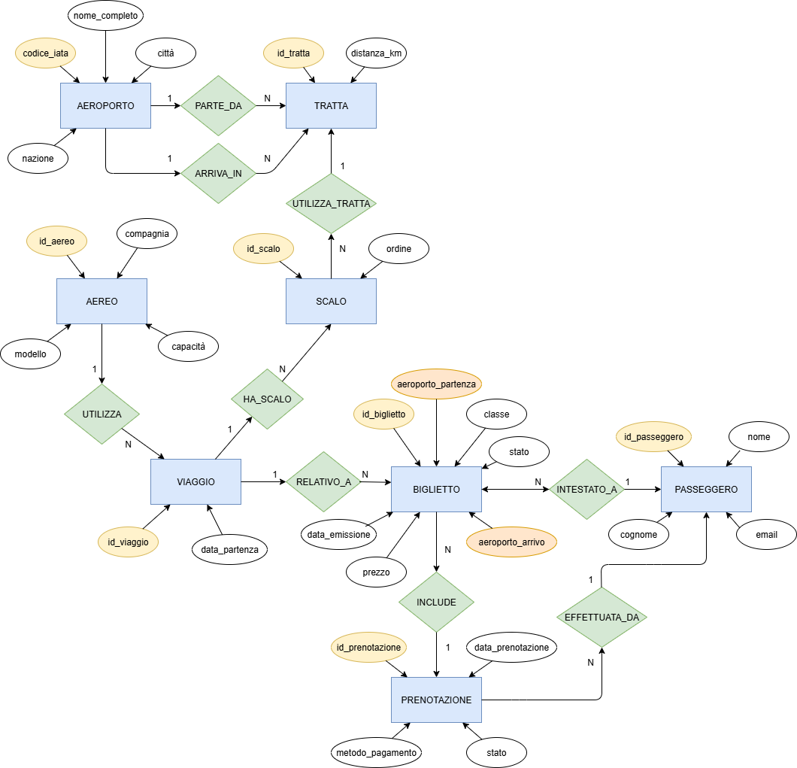

# ITA Airways e la sfida della gestione digitale: progettazione di un sistema informativo su misura

Repository sviluppato per il Project Work finale del Corso di Laurea in *Informatica per le Aziende Digitali (L-31)* – Università Telematica Pegaso.

📌 **Obiettivo**: progettare un sistema informativo relazionale per supportare ITA Airways nella gestione digitale delle prenotazioni, nell’emissione dei biglietti e nel monitoraggio dei voli (inclusi quelli con scalo), offrendo funzionalità operative e di analisi.

---

## 🎯 Obiettivi principali

- Modellazione delle entità centrali: Passeggero, Biglietto, Prenotazione, Viaggio, Tratta, Scalo, Aereo, Aeroporto  
- Gestione completa del ciclo di vita delle prenotazioni  
- Supporto a voli diretti e con scalo (via tabella `Scalo`)  
- Integrazione di query SQL per operatività e analisi dei dati  

---

## 📂 Contenuto del repository

- `DIAGRAMMA_ER.sql` – Codice DBML per la generazione del diagramma ER  
- `DIAGRAMMA_ER_ITA_Airways.png` – Diagramma ER esportato in formato immagine  
- `ITA_Airways_DB_script.sql` – Script completo per la creazione del database e dati di esempio  
- `ITA_Airways_8_query.sql` – File con 8 query SQL operative  
- `README.md` – Questo file

---

## 🧰 Requisiti tecnici

- PostgreSQL ≥ 15  
- Tool consigliati: pgAdmin, DBeaver  
- Alternative online per test:
  - https://dbfiddle.uk  
  - https://extendsclass.com/postgresql-online.html  

---

## 🛠️ Istruzioni per l’uso

1. Importa `ITA_Airways_DB_script.sql` nel tuo ambiente PostgreSQL  
2. Esegui lo script per creare le tabelle e popolare i dati  
3. Lancia le query dal file `ITA_Airways_8_query.sql`  
4. Consulta il diagramma ER per comprendere la struttura logica del sistema

---

## ✈️ Funzionalità principali

- Gestione completa di prenotazioni e biglietti  
- Tracciamento dello stato di prenotazione e biglietto  
- Rappresentazione dei voli con scalo in ordine sequenziale  
- Analisi clienti per ricavi e fidelizzazione  
- Controllo overbooking e trend di prenotazione  

---

## ✅ Query SQL incluse

1. Ricerca biglietti disponibili per i viaggi futuri  
2. Storico delle prenotazioni di un passeggero  
3. Verifica della validità di un biglietto  
4. Percorso completo di un viaggio (tratte + scali)  
5. Analisi passeggeri VIP per spesa e frequenza  
6. Controllo overbooking per i voli in partenza  
7. Trend prenotazioni e ricavi mensili  
8. Statistiche generali del sistema (dashboard)

---

## 📊 Diagramma ER

> Realizzato con [dbdiagram.io](https://dbdiagram.io)

  

---

## 📖 Fonti e strumenti consultati

- [ITA Airways – Sito ufficiale](https://www.ita-airways.com)  
- [PostgreSQL – Documentazione](https://www.postgresql.org/docs)  
- [pgAdmin Project – Documentazione](https://www.pgadmin.org/docs/)  
- C.J. Date – *An Introduction to Database Systems* (2003)  
- Elmasri & Navathe – *Fundamentals of Database Systems* (2017)  
- [IATA – Digital Transformation](https://www.iata.org)  
- [ENAC](https://www.enac.gov.it), [MIT Trasporti](https://www.mit.gov.it) – Documenti istituzionali  
- [Codemotion – Costi software su misura](https://www.codemotion.com/magazine/dev-life/quanto-costa-far-sviluppare-un-software-su-misura/)  
- [Clutch.co – Development Cost Guide](https://clutch.co/developers/resources/how-much-does-software-development-cost)  
- [Statista – Airline RASK Data](https://www.statista.com/statistics/1102085/airline-industry-rask-globally/)  
- [dbfiddle.uk](https://dbfiddle.uk), [extendsclass.com](https://extendsclass.com/postgresql-online.html)  
- [Stack Overflow](https://stackoverflow.com), [W3Schools](https://www.w3schools.com/sql/)

---

## 👨‍💻 Autore

- **Nome:** Paolo Stranges  
- **Matricola:** 0312201143  
- **Università:** Università Telematica Pegaso  
- **Corso di Laurea:** Informatica per le Aziende Digitali (L-31)
