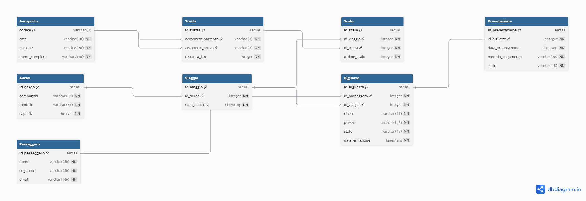

# ITA Airways e la sfida della gestione digitale: progettazione di un sistema informativo su misura

Repository sviluppato per il Project Work finale del Corso di Laurea in *Informatica per le Aziende Digitali (L-31)* – Università Telematica Pegaso.

📌 **Obiettivo**: progettare un database relazionale su misura per la gestione delle prenotazioni, dell’emissione dei biglietti e del monitoraggio dei voli (inclusi quelli con scalo), supportando le principali esigenze operative e analitiche di ITA Airways.

---

## 🎯 Obiettivi principali

- Modellazione delle entità: Passeggero, Biglietto, Prenotazione, Viaggio, Tratta, Scalo, Aereo  
- Gestione completa del ciclo di vita della prenotazione  
- Supporto per voli diretti e con scalo tramite tabella intermedia  
- Query SQL per gestione, controllo e analisi  

---

## 📂 Contenuto del repository

- `DIAGRAMMA_ER.sql` – Script per generare il diagramma ER su dbdiagram.io  
- `DIAGRAMMA_ER_ITA_Airways.png` – Diagramma ER in formato immagine  
- `ITA_Airways_DB_script.sql` – Script SQL completo (DDL + DML)  
- `ITA_Airways_8_query.sql` – Esempi di query SQL dimostrative  
- `README.md` – Questo file

---

## 🧰 Requisiti tecnici

- PostgreSQL ≥ 15  
- Tool consigliati: pgAdmin, DBeaver  
- Alternative online per test:
  - https://dbfiddle.uk  
  - https://extendsclass.com/postgresql-online.html

---

## 🛠️ Istruzioni per l’uso

1. Importa `ITA_Airways_DB_script.sql` nel tuo ambiente PostgreSQL  
2. Esegui lo script per creare tabelle, relazioni e dati di esempio  
3. Esegui le query da `ITA_Airways_8_query.sql`  
4. Consulta il diagramma ER per comprendere la struttura del modello

---

## ✈️ Funzionalità principali

- Gestione prenotazioni e biglietti con tracciamento dello stato  
- Supporto per voli con scalo (in ordine sequenziale)  
- Verifica della validità di un biglietto  
- Analisi delle tratte più richieste  
- Estrazione delle prenotazioni attive per data

---

## ✅ Query SQL incluse

1. Biglietti disponibili per una tratta e data  
2. Storico delle prenotazioni di un passeggero  
3. Verifica validità di un biglietto  
4. Voli con scalo tra due aeroporti  
5. Numero di biglietti venduti per una tratta  
6. Prenotazioni attive in una determinata data

---

## 📊 Diagramma ER

> Realizzato con [dbdiagram.io](https://dbdiagram.io)

  

---

## 📖 Fonti e strumenti consultati

- [ITA Airways – Sito ufficiale](https://www.ita-airways.com)  
- [PostgreSQL – Documentazione ufficiale](https://www.postgresql.org/docs)  
- pgAdmin Project – Documentazione  
- C.J. Date – *An Introduction to Database Systems* (2003)  
- Elmasri & Navathe – *Fundamentals of Database Systems* (2017)  
- [IATA – Digital Transformation](https://www.iata.org)  
- [Codemotion – Costi sviluppo software su misura](https://www.codemotion.com/magazine/dev-life/quanto-costa-far-sviluppare-un-software-su-misura/)  
- [Clutch.co – Software Development Cost Guide](https://clutch.co/developers/resources/how-much-does-software-development-cost)  
- [Statista – Airline RASK Data](https://www.statista.com/statistics/1102085/airline-industry-rask-globally/)  
- [ENAC](https://www.enac.gov.it), [MIT Trasporti](https://www.mit.gov.it/) – Documenti istituzionali  
- [dbdiagram.io](https://dbdiagram.io), [dbfiddle.uk](https://dbfiddle.uk), [extendsclass.com](https://extendsclass.com/postgresql-online.html)  
- [Stack Overflow](https://stackoverflow.com), [W3Schools](https://www.w3schools.com/sql/) – Per debugging e sintassi SQL

---

## 👨‍💻 Autore

- **Nome:** Paolo Stranges  
- **Matricola:** 0312201143  
- **Università:** Università Telematica Pegaso  
- **Corso di Laurea:** Informatica per le Aziende Digitali (L-31)
